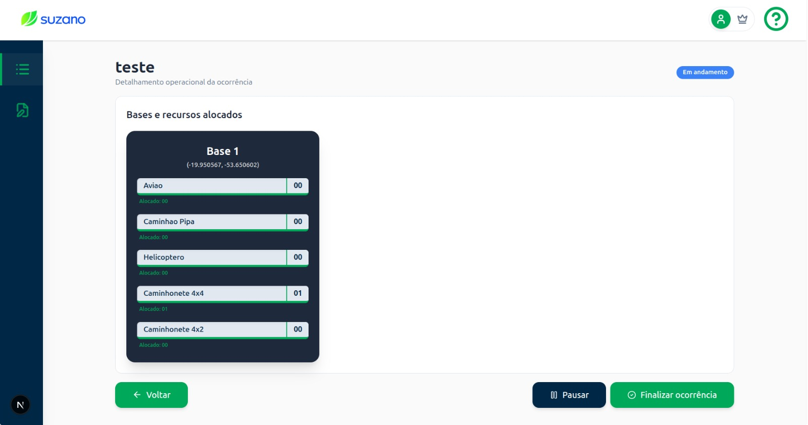

# Entrega: Teste de Usabilidade (Técnica do Funil)

* Nomw: Maria Eduarda Barbosa Oliveira
* Turma: T15 - Ciência da Computação

---

### 1. Tela(s) analisada(s)

* **Visualização:** 

* **Descrição do contexto:** Fluxo de gerenciamento de chamados onde o usuário visualiza a lista de registros e acessa os detalhes para interromper o progresso de uma atividade (pausar a ocorrência).

### 2. Tipo de teste

* **Indicação:** Tarefa do usuário.

* **Explicação:** O teste foca na eficiência do fluxo de navegação e na descoberta da funcionalidade de pausa dentro da interface de detalhes da ocorrência.

### 3. Conjunto de perguntas

1.  **Contexto Geral:** "Ao observar esta tela com todas as ocorrências, o que você entende que cada item representa e quais ações você acha que pode realizar?"

2.  **Exploração de Fluxo:** "Se você recebesse uma instrução para interromper o trabalho nesta ocorrência específica, como você faria para encontrar essa opção?"

3.  **Execução Direta:** "Agora que você selecionou a ocorrência, o comando para 'Pausar' está visível ou você sente que ele está escondido em algum menu?"

4.  **Validação de Feedback:** "Após realizar a ação, como você tem certeza de que o sistema realmente entendeu que esta ocorrência está pausada?"

### 4. Objetivo do teste

* Identificar se a hierarquia da informação permite uma localização rápida da função de pausa e se o feedback visual de alteração de status é compreendido pelo usuário.

### 5. Ação ou entendimento esperado

* O usuário deve ser capaz de navegar da lista para o detalhe e concluir a interrupção da ocorrência sem hesitação, reconhecendo imediatamente a mudança visual no status do item.